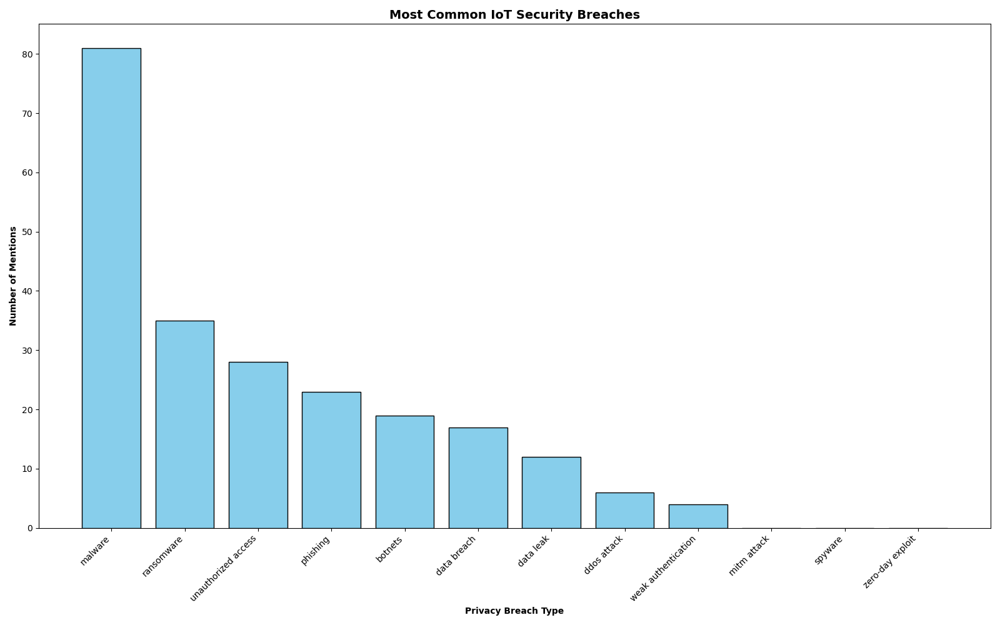
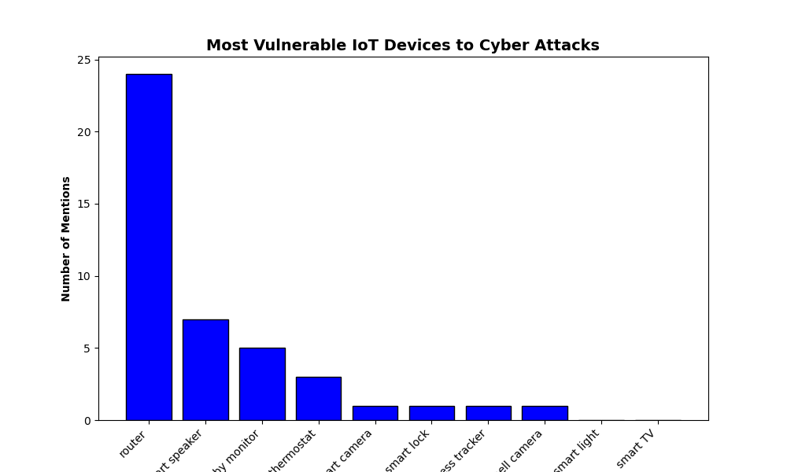
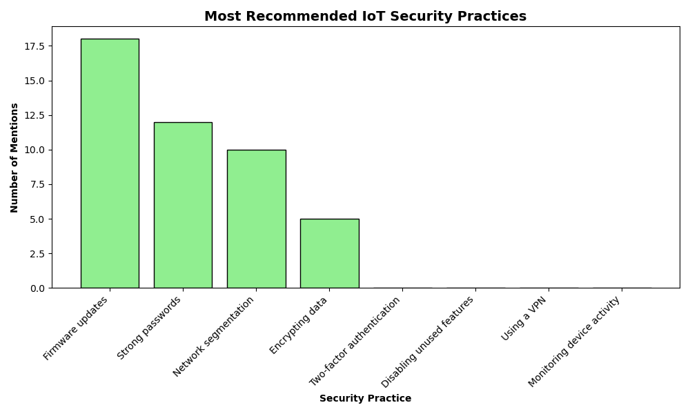

# iot-security-analysis
Web scraping and analyzing real-time IoT security breach data using Python

# IoT Security & Privacy Breaches

This project investigates real-world **security and privacy vulnerabilities** in IoT (Internet of Things) devices by scraping data from online discussions, blogs, and academic sources. Using Python, Reddit API, and BeautifulSoup, we identify the most common breaches, the most vulnerable devices, and recommended safety practices.

## Project Highlights

- Web scraping using `BeautifulSoup` and `PRAW`
-  Data visualization with `matplotlib`
-  Text normalization and keyword analysis
-  Research on real-time threats in IoT infrastructure

## 🛠 Tech Stack

- Python
- BeautifulSoup
- PRAW (Reddit API Wrapper)
- pandas, matplotlib, numpy
- Jupyter Notebook

##  Research Questions

1. What are the most common types of privacy breaches in IoT devices?
2. Which IoT devices are most vulnerable to attacks?
3. What are the most recommended security practices?

## Sample Output

### Most Common IoT Breaches

### Most Vulnerable Devices

### Best Practices

##  Folder Structure
iot-security-analysis/
├── visualizations/
│   ├── iot_breaches.png
│   ├── vulnerable_devices.png
│   └── security_practices.png

## Author

**Hiral Airan**  
Aspiring software engineer passionate about AI, cybersecurity, and real-world data analysis.

## Acknowledgements
- Reddit API and BeautifulSoup guides from GeeksForGeeks

